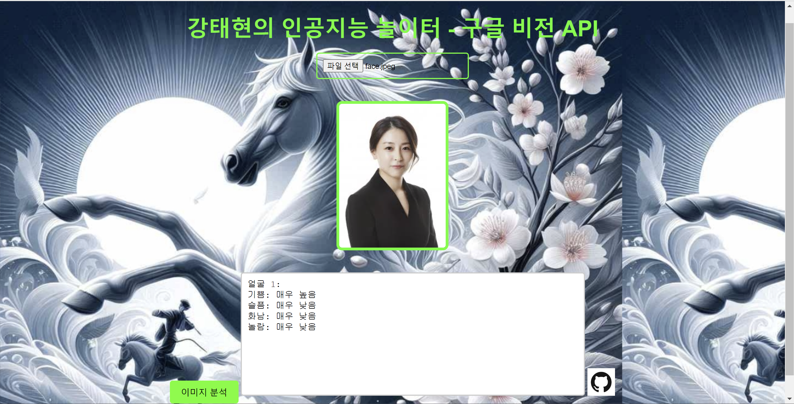

# project1-2024
2024-2학기 캡스톤프로젝트 수업
OpenAPI를 사용한 이공지능 시스템 실습


## 💻 My Stack
 
   


## 💻 ...
<a href = "https://github.com/Hun-Se">
</a> <a href = "https://for-it-study.tistory.com/"> </a>
</a> <a href = "hun-se.slack.com"> </a>

# openweathermap

지정된 장소의 현재 날씨를 표시
https://api.openweathermap.org/data/2.5/weather?q=london&units=metric&appid=7d96bc5108f52b80e2d9075a369b9f35
- [실습해보기](https://api.openweathermap.org/data/2.5/weather?q=london&units=metric&appid=7d96bc5108f52b80e2d9075a369b9f35)


```javascript
$.ajax({
			type: "GET",
			url: 'https://api.openweathermap.org/data/2.5/weather?q=london&units=metric&appid=7d96bc5108f52b80e2d9075a369b9f35',
		}).done(function(response) {

            console.log(response)
            
		}).fail(function(error) {
			alert("!/js/user.js에서 에러발생: " + error.statusText);
		});


```


# openAI

OpenAI에서 제공하는 텍스트새엇ㅇ 및 이미지 생성 실습 텍스트생성


https://api.openai.com/v1/chat/completions
- [실습해보기](https://api.openai.com/v1/chat/completions)

```javascript
 $.ajax({
        type:"POST",
        url: "https://api.openai.com/v1/chat/completions",
        headers:{
            "Authorization": "Bearer " + OPENAPI_KEY
        },
        data: JSON.stringify(data),
        contentType: "application/json; charset=utf-8"
    }).done( function(response){
        console.log(response)
        //alert(response.choices[0].message.content)
        txtOut.value = response.choices[0].message.content
    }).fail(function(error){
        console.log(error)
        errormsg = error.status + " : " + error.responseJSON.error.code + " - " + error.responseJSON.error.message
        txtOut.value = (errormsg)
    }

    )
```
- 이미지 생성
```javascript
    $.ajax({
        type:"POST",
        url: "https://api.openai.com/v1/images/generations",
        headers:{
            "Authorization": "Bearer " + OPENAPI_KEY
        },
        data: JSON.stringify(data),
        contentType: "application/json; charset=utf-8"
    }).done( function(response){
        console.log(response)
        //alert(response.choices[0].message.content)
       gimage.src = response.data[0].url
       gimage2.src = response.data[1].url
    }).fail(function(error){
        console.log(error)
        errormsg = error.status + " : " + error.responseJSON.error.code + " - " + error.responseJSON.error.message
        txtOut.value = (errormsg)
    })

```

# gogle cloud vision

google cloud vision 으로 얼굴감지 하기
https://vision.googleapis.com/v1/images:annotate?key=
- [실습해보기](https://vision.googleapis.com/v1/images:annotate?key=)

```
$.ajax({
        type: "POST",
        url: 'https://vision.googleapis.com/v1/images:annotate?key=' + GOOGLEAPI_KEY,
        headers: {
            "Accept": "application/json",
            "Content-Type": "application/json"
        },
        data: JSON.stringify(data),
        contentType: "application/json; charset=utf-8"
    }).done(function (response) {
        console.log(response);
        var annotations = response.responses[0].faceAnnotations;
        var emotions = '';

        if (annotations) {
            annotations.forEach(function(annotation, index) {
                emotions += `얼굴 ${index + 1}:\n`;
                emotions += `기쁨: ${translateLikelihood(annotation.joyLikelihood)}\n`;
                emotions += `슬픔: ${translateLikelihood(annotation.sorrowLikelihood)}\n`;
                emotions += `화남: ${translateLikelihood(annotation.angerLikelihood)}\n`;
                emotions += `놀람: ${translateLikelihood(annotation.surpriseLikelihood)}\n\n`;
            });
        } else {
            emotions = "얼굴이 감지되지 않았습니다.";
        }

        document.getElementById("faceAnnotations").value = emotions;
    }).fail(function (error) {
        console.log(error);
        document.getElementById("faceAnnotations").value = "오류: " + JSON.stringify(error, null, 2);
    });

```
- 실행결과




개발순서
1. 소스수정
2. 소스 저장
3. 스테이지
4. 커밋앤 푸쉬
5. 커밋메시지


git설정
git config --global user.name "Kang"
git config --global user.email"gang0730@shingu.ac.kr"


두번째 수정


2024-9-19 깃허브연동실습
로컬에서 편집함
